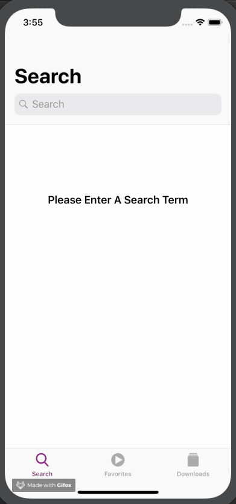

# IOS Podcast App
> A Simple Apple Podcast App Clone

[](https://github.com/Carthage/Carthage)
[](https://img.shields.io/cocoapods/v/LFAlertController.svg)  
[](http://cocoapods.org/pods/LFAlertController)

## Search For Podcasts


## Installations
```
git clone https://github.com/rutaks/ios-podcast-app.git

cd ios-podcast-app/

pod install
```
#### CocoaPods
You can use [CocoaPods](http://cocoapods.org/) to install the following dependencies by adding it to your `Podfile`, if not found by any chance:
```
    pod 'Alamofire', '~> 5.0.0-rc.2'
    pod 'SVProgressHUD'
    pod 'SDWebImage','~> 4.0'
```
## Requirements
- iOS 10.0+
- Xcode 10.03

## Contributor(s)

Samuel Rutakayile – [@Rutaks](https://github.com/rutaks)

Distributed under the MIT license.